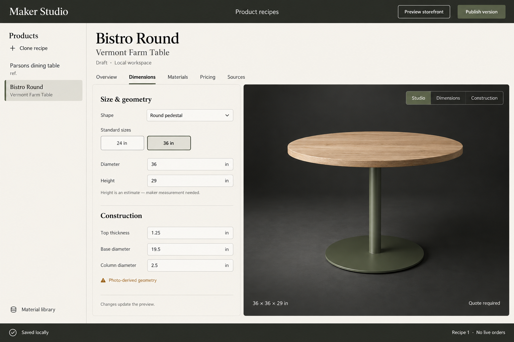

# Product Studio v1 — design contract

## Selected concept

Use case: ui-mockup. Design a complete desktop web app screen at 1536x1024 for "Maker Studio", a premium internal product recipe editor. Match the established furniture configurator style: charcoal #23271f, warm ivory #f3f0e9, moss #505740, Georgia serif large product names and Barlow-like sans-serif UI. Code-native controls, no marketing hero, no cards or fake metrics. Header 72px: Maker Studio left, "Product recipes" center, buttons "Preview storefront" and solid moss "Publish version" right. Left navigation rail 240px, ivory: heading Products, small "+ Clone recipe" action, two rows "Parsons dining table" / "ref." and selected "Bistro Round" / "Vermont Farm Table". Bottom rail link "Material library". Main workspace to right: top title "Bistro Round", subtitle "Vermont Farm Table", small text "Draft · Local workspace". Horizontal tabs: Overview, Dimensions, Materials, Pricing, Sources. Main split: left 460px ivory property editor, right dark charcoal studio 750px. Dimensions tab selected. Form heading "Size & geometry". Shape field "Round pedestal". Standard sizes two outlined buttons "24 in" and selected "36 in". Fields Diameter "36 in", Height "29 in". Clear small note "Height is an estimate — maker measurement needed." Next divider heading "Construction". Fields Top thickness "1.25 in", Base diameter "19.5 in", Column diameter "2.5 in". Small amber text "Photo-derived geometry". Footer left simple text "Changes update the preview." Right studio realistic 3D preview of a small round cafe table with natural light white-oak top, slender mountain-green cylindrical steel pedestal and low circular green disk base. The table should look geometrically simple, believable and modern, strong product lighting and soft shadows. Above model right aligned toggle "Studio / Dimensions / Construction". Below model footer "36 × 36 × 29 in" left and "Quote required" right. The main form and viewport have one shared clean frame. Bottom global status bar "Saved locally" left, "Recipe 1 · No live orders" right. All exact labels clear and readable, calm restrained tools, visible focus affordances. Show entire app, no cropped controls, practical React CSS implementation.

## Implementation constraints

Keep the charcoal header, warm ivory navigation and editor, moss selections, serif product title and dark live 3D stage. The dimensions tab is the primary screen. At 1536×1024, show the full header, product identity, tabs, split workspace and status footer. Render all controls and text in React/CSS. Use the actual recipe-driven geometry and physical materials, not the concept image as the preview.

Functional extensions: explicit Save draft, editable sources and confidence, version history, compatibility exclusions, reusable material library, clone flow, recipe export. Local publication creates an immutable recipe version and storefront route; it does not send anything to a maker or create orders. The mobile screen stacks the preview and editor. Additional helper copy must be factual, short, and specific to the field.

## Visual verification targets

Compare header height and hierarchy; 240–256px left rail; large serif product identity; form/preview balance; warm ivory/charcoal/moss palette; circular oak table with green pedestal; restrained form borders; bottom saved-state bar. Intentional deviations and screenshot evidence are recorded in QA.md.

