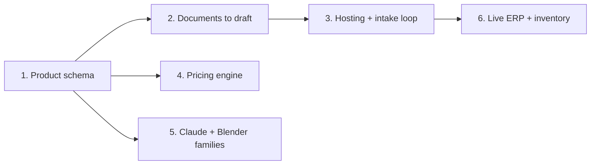

# Arc CPQ roadmap

Plan of record for turning Arc from a set of hand-built configurators into an
automated configure-price-quote platform. Adopted 2026-09-30.

**Current phase:** 1 and 2 together (the pilot, below). Nothing started yet.

Keep this file short and current. Update "Where we are" and the phase status
when work lands, tick exit criteria as they pass, and add dated entries to the
decision log. Don't prepend daily notes; session detail belongs in commit
messages.

---

## North star

A maker uploads what they already have: price sheets, spec PDFs, product
pages, spreadsheets, photos and drawings. Claude turns it into a working
configurator with options, rules, prices and a 3D preview. The maker reviews
and approves it. Customers configure and receive quotes, and accepted orders
flow into the maker's ERP or inventory system.

Claude does the drafting. People approve.

## Principles

These apply to every phase.

1. **Products are data, not code.** Code is for shared templates (geometry,
   UI, the engine). Each maker's products are data that Claude can write and a
   person can read.
2. **Claude proposes, a person approves.** Every AI-made change goes through
   the proposal and review flow with history, the same as a human edit.
3. **Every fact has a source.** Prices, options and dimensions carry where
   they came from and how confident we are. Unknown stays unknown: a missing
   price is stored as null and never shown as free (existing convention).
4. **Wrong is worse than missing, especially for prices.** When the documents
   don't settle something, it becomes a question for the maker, not a guess.
5. **One master per physical product.** The same geometry feeds the
   configurator, Blender and Fall Line
   ([CPQ asset reuse contract](https://github.com/wellesruhlin/fall-line/blob/main/docs/CPQ-ASSET-REUSE-CONTRACT.md)).
6. **Prove before replacing.** New systems take over only after parity or
   golden tests show they reproduce what they replace, as the ON3P rebuild did.

---

## Where we are (2026-09-30)

Built = works and is tested. Partial = the bones exist, not yet what the
vision needs. Not started = nothing yet.

| Stage | Status | What exists | Where |
|---|---|---|---|
| Intake | Partial | Site form stores a request with one file (up to 5 MB) and moves it through stages new → reviewed → concept → shared → proposal → customer. Nothing reads the files. | `apps/site` (D1 table `concept_requests`, files in R2) |
| Extraction | Not started | Each maker was onboarded with its own hand-written import script. | `brands/praxis/scripts/import-catalog.mjs`, `brands/proteus/scripts/`, `apps/maker-studio/scripts/seed-recipes.mjs` |
| Product model | Partial | Three different shapes (see below). No single format. | `brands/*`, `apps/outreach/src/pack.js`, `packages/product-recipes` |
| Maker review | Partial | Proposals from a person or an agent (1–50 changes) are validated, applied with revision checks, and kept in history. Covers price lists, availability rules and connectors only, not product definitions. | `apps/maker-studio/server/management-*.mjs`, `/manage` |
| Rules engine | Built | Validates choices in order, explains why options are unavailable, handles fixed values, resets, quote-only items, build sheets and share links. | `packages/configurator/src/engine` |
| 3D and Blender | Built (skis, 2 tables) | Shared ski kernel with golden tests, outlines traced from maker drawings, Blender library and exports, scripted LOOK Pivot binding. Two table templates share geometry with Blender; the Bistro round trip (browser build → Blender) is verified with no measured vertex error. | `packages/ski-geometry`, `labs/on3p-ski-lab`, `brands/on3p/blender`, `packages/product-recipes/geometry.mjs`, `apps/maker-studio/blender` |
| Pricing | Partial | Per-option prices in brand packs, quote-only ranges, and Maker Studio price lists ("reference plus rules" with field = value adjustments). Integer minor units. | brand `pack.js` files, `packages/configurator/src/product/management.mjs` |
| Quote and order | Partial | Server re-prices every build. Immutable build, quote and order records. Quotes move needs review → approved → awaiting acceptance / expired → accepted. One product per order. No quote document, no payment. | `apps/maker-studio/server/handoff-store.mjs` |
| ERP and inventory | Partial | Connectors with field mapping, retries and receipts. The provider list names 12 outside systems (Shopify, QuickBooks, NetSuite and others), but only the download-a-CSV/JSON transport works. | `packages/configurator/src/product/management.mjs`, `/handoff` |
| Hosting | Not started | Maker Studio runs only on the local machine (127.0.0.1, local SQLite and JSON files). The site runs on ChatGPT Sites. No customer accounts or workspaces. | `apps/maker-studio/server/index.mjs`, `apps/site/README.md` |

166 tests pass across the workspace.

### The three product shapes today

| Shape | Used by | Size | Notes |
|---|---|---|---|
| Coded brand pack for `createEngine()` | ON3P, Praxis, Proteus | ~1,340 / ~2,150 / ~1,740 lines of pack code | Rules and prices are JavaScript functions. Richest UI and 3D. |
| Catalog JSON through a shared template | Meier, Folsom, Grass Sticks | 5–42 lines each plus JSON | Nearly data, but the template (`apps/outreach/src/pack.js`) is ski-specific and branches per maker. |
| Recipe JSON | ref. Parsons, Vermont Farm Table Bistro | JSON only | Validated and compiled (`validateRecipe`, `compileRecipe`). Tied to two table templates. |

All three end up on the same order-side contract: `defineProduct()`, with
`engineProduct()` wrapping a brand engine. That shared contract is what makes
a single product format feasible.

### The core gap

Every step that turns a maker's documents into a working configurator is done
by hand: a site-specific import script, then code (or a domain-specific
template) for rules and prices. Automation depends on products becoming data
that Claude can write and a maker can approve. Everything else in the vision
plugs into that.

---

## Phases

Phases 1 and 2 run together as the pilot. Phases 4 to 6 are ordered by what
the first paying customer needs; see open decisions.

### Phase 1: Arc product schema

**Goal.** One JSON format that can describe any product, compiled into the
existing engine so the UI, quoting and handoff work unchanged.

#### Build

- A new package, `@arc/product-schema`: the format, a validator, and
  `compileProduct(schema)`, which returns an engine pack for `createEngine()`.
- What the format covers:
  - identity and versions (draft and published, as recipes do today)
  - steps and option groups, using the engine's existing group types
  - options that depend on earlier choices, as lookup tables
  - availability rules as data (requires, excludes, limits a range), each
    with the reason the customer sees
  - pricing as data: base price, per-option amounts, rule-based adjustments,
    quote-only ranges, and unknown (null) prices
  - presentation: which 3D template, how options map to its parameters, and
    materials
  - provenance on every fact: source document, where in it, date observed,
    and confidence (extending the recipes' existing `confidence` field)
- Recipes become a case of the schema: either migrate them or compile them
  through it.
- An escape hatch: a pack can combine schema data with code hooks for what
  data can't express yet. ON3P stays code-heavy for now.

#### Exit criteria

- [ ] ref. Parsons, Vermont Farm Table Bistro and Meier run purely from schema
  files, and their existing tests pass.
- [ ] A parity test (same approach as `brands/on3p/test/parity.test.js`) shows
  the schema versions match today's behavior over random sessions:
  normalization, edits, prices and build sheets.
- [ ] Praxis's custom catalog is expressed in the schema and validates. This
  becomes the answer key for Phase 2.
- [ ] A README for the package with one worked example.

**Out of scope.** Moving the ON3P, Praxis or Proteus UIs; new geometry.

**Main risk.** Over-designing the rules language. Start with lookup tables and
a handful of rule forms, and add a form only when a real maker needs it.

### Phase 2: Documents to draft product, with Claude

**Goal.** Claude reads a maker's documents and produces a draft product in the
schema that a person can review, correct and approve.

#### Build

- **Ingestion.** Accept PDFs, spreadsheets, saved web pages, product JSON and
  images. Keep a locator for everything (file, page, section) so each
  extracted fact can point back to its source.
- **Extraction.** Claude, through the Claude API, returns schema-shaped output
  with a source and confidence on every field, plus a list of open questions
  for the maker.
- **Automatic checks before a person sees it.**
  - The draft validates against the schema.
  - Every option can be reached, and no combination dead-ends.
  - Every configuration either has a positive price or is explicitly
    quote-only.
  - Every price has a citation.
- **Review.** The draft lands in Maker Studio as a proposal from `agent`. This
  means adding product definitions to the resource kinds the proposal flow
  handles, and a review screen that shows each field next to its source.
- **Benchmark harness** in `qa/extraction/`: run extraction on saved sources
  and score it field by field against the hand-built catalogs.

**Benchmark set.** Only these makers have their raw sources saved in the repo:

| Maker | Saved inputs | Answer key |
|---|---|---|
| Praxis | 22 custom-ski order-form pages, plus construction and ordering pages (`brands/praxis/art-source/pages`) | `brands/praxis/src/configurator/data/custom-catalog.json` |
| Proteus | 78 saved site pages (`brands/proteus/art-source/pages`) | `brands/proteus/src/data/catalog.json` |
| ON3P | 15 cached product JSON files (`work/stock-2027`) | `brands/on3p/src/catalog.json`, `compatibility.json` |
| ref. Parsons | Product JSON (`apps/maker-studio/reference`) | `packages/product-recipes/seeds.json` |
| Vermont Farm Table Bistro | 4 product JSON files (`apps/maker-studio/reference/vft-bistro`) | `packages/product-recipes/seeds.json` |

Meier, Folsom and Grass Sticks kept only their extracted catalogs, with links
to the live pages. Scoring them means re-fetching pages that may have changed
since the catalogs were built.

Praxis is the first benchmark: real, messy HTML order forms with 22 models,
per-model lengths, core options with price differences, flex, graphics,
veneers and text fields, and an answer key produced by a hand-written import
script.

#### Exit criteria

- [ ] Praxis: every model, length, option and price either matches the answer
  key or is raised as a question. Zero silently wrong or uncited prices.
- [ ] The same bar on at least two more benchmark makers.
- [ ] One new maker with no hand-built answer key goes from documents to an
  approved, working configurator. Record how long the review took.

**Main risks.**

- Confident wrong answers. That is what the citation requirement and the
  "question, not guess" rule are for.
- Cost and speed per run. Measure them on the benchmark before choosing
  models and batching.

### Phase 3: Hosting and the intake loop

**Goal.** Arc runs somewhere customers can reach, and a product request with
documents becomes a draft configurator without anyone touching code.

#### Build

- **Host.** Recommended: Welles's own Cloudflare account (Workers, D1 for
  data, R2 for files). The site already uses D1 and R2 through ChatGPT Sites,
  so moving it is a short step.
- **Maker Studio server.**
  - Move the local SQLite stores to hosted storage.
  - Add real accounts.
  - Give each maker a separate workspace, with every record keyed to one.
- **Intake form.** Accept multiple files and larger ones; real catalogs are
  bigger than 5 MB.
- **The loop.** A new request with files runs Phase 2 and puts the draft in a
  new workspace. Welles gets notified; the site README already names an inbox
  integration as the next step.
- **Backups** for the hosted equivalent of `work/maker-studio-builds`.

#### Exit criteria

- [ ] A request submitted on the site produces a reviewable draft
  configurator.
- [ ] Two makers' workspaces cannot see each other's data (tested).
- [ ] Nightly backups exist and a restore has been tried.

**Guardrail.** Public launch and any contact with makers need Welles's
go-ahead. Demos built on other makers' artwork stay private (see `CLAUDE.md`).

### Phase 4: Pricing engine

**Goal.** Pricing a maker's sales team would trust without overrides.

**Candidates.** Build these in the order the first customer needs them:

- dated price books (effective from and to) with versions
- channels and tiers: retail, dealer, wholesale
- quantity breaks
- cost and margin floors, with alerts
- discounts that need approval above a threshold, reusing the quote approval
  states
- multi-line quotes: several products plus accessories (today it's one
  product per order)
- calculated tax and shipping (the fields exist; values are manual)
- a quote document (PDF) and a customer acceptance page
- deposits and payment, later, as a separate decision

#### Exit criteria

- [ ] The first paying maker's full price list is expressed with no manual
  overrides.
- [ ] A multi-line quote goes from build to approval to PDF to acceptance.

### Phase 5: Claude + Blender for new product families

**Goal.** Add product families without hand-writing each geometry template.

**Today.** The ski/board kernel, two table templates, the scripted LOOK Pivot
binding, and outline tracing from maker drawings.

#### Build

- **A small template library.** Pick families from real customer demand; boards,
  tables, cabinets and frames are candidates. Each template is:
  - a parametric generator for the browser
  - the same parameters driving a Blender Python build
  - a parameter block in the product schema
  - golden tests
- **Claude fits templates.** Claude picks a template and fits its parameters
  from drawings, photos and spec tables.
- **Checked renders.** Blender renders headless. The result is checked against
  the reference image's outline (the Praxis tracer is the seed of that check)
  and against the published dimensions. Claude iterates until it is within
  tolerance.
- **Outputs.** A browser model and a `.blend` master, with a person approving.

#### Exit criteria

- [ ] One new family (not skis or the two tables) added with Claude doing the
  fitting, with geometry within tolerance of the published dimensions.

**Link to Fall Line.** Masters follow the asset reuse contract. Fall Line's
Blender job E01 (Woodsman 108 assembly) is a shared master.

### Phase 6: Live ERP and inventory

**Goal.** Orders reach the maker's systems automatically, and stock and lead
times flow back into the configurator.

#### Build

- **First connectors.** Add an API transport alongside the file handoff for
  the first customers' systems: likely Shopify for orders, plus one small-maker
  inventory tool already in the provider list (Katana, MRPeasy or Odoo).
- **Orders out.** Push accepted orders, with retries and receipts (existing
  framework).
- **Stock and lead times in.** Stock and lead-time sync feeds availability
  rules, so out-of-stock options switch off with a reason. Lead times show in
  the configurator.
- **Credentials.** Keep them outside configuration, as the existing
  `credentialRef` rule requires.

#### Exit criteria

- [ ] An accepted order appears in the maker's system with no file download.
- [ ] A stock change disables the matching option within an agreed interval.

---

## The pilot: first project

Phases 1 and 2 together, scoped so one loop proves the whole idea.

1. Draft the schema from what recipes, the outreach catalogs and Praxis's
   custom catalog need, with examples.
2. Write `compileProduct()`. Run Parsons, Bistro and Meier from schema files
   and add parity tests.
3. Hand-convert Praxis's custom catalog into the schema. It is both a test of
   the format and the Phase 2 answer key.
4. Build the extraction harness. Run Claude over the saved Praxis pages, score
   the result, and iterate.
5. Send drafts into Maker Studio's proposal review.
6. Run the benchmark on Proteus, ON3P and the tables.

#### Deliverables

- a scorecard per maker
- a Claude-drafted Praxis product that loads and prices in the configurator
- the review screen showing each field with its source

---

## Open decisions

| Decision | Why it matters | Status |
|---|---|---|
| First paying customer profile: ski/board makers, or small manufacturers broadly (furniture and similar) | Ski/board reuses existing geometry. Broader makers pull Phase 5 forward. Sets the order of Phases 4 to 6. | Open |
| Hosting target | Phase 3 depends on it. Own Cloudflare account recommended. | Open |
| GitHub repo name (`wellesruhlin/rivet` → e.g. `arc-cpq`) | Consistency. Old links redirect after a rename. | Open, rename in GitHub settings |
| Final brand identity | `apps/site/public/arc-logo.svg` is a placeholder. | Open |
| Arc's own pricing | The site offers $3,000 setup + $299/month (founding). Automation lowers setup effort; decide whether the offer changes. | Open |
| Outreach to the demo makers | Demos use their artwork; contact needs Welles's go-ahead. | Open |

## Decision log

- **2026-09-29:** All Arc apps in one private repository with one shared
  configurator engine. ON3P was rebuilt on it and verified with parity tests.
- **2026-09-30:** Renamed Rivet CPQ to Arc CPQ; packages moved from `@rivet/*`
  to `@arc/*`.
- **2026-09-30:** Adopted this roadmap. Products as data (Phase 1) is the
  foundation, and Phases 1 and 2 run together as the pilot, benchmarked on
  Praxis.
